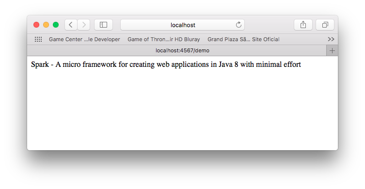

# Java EE con Spark

Aplicación Java Web usando Spark Framework.


## Prerequisitos

1. Maven 3+
2. Java 8+

## Como correr

1. Clon

	```
	git clone https://github.com/humbertodias/java-spakr-demo.git
	```

2. Entrar en la carpeta

	```
	cd java-spark-demo
	```

3. Correr 

	```
	mvn package exec:java -Dexec.mainClass="DemoSpark"
	```
	
	```
 qtp1959372581-14 DEBUG io.ManagedSelector - Selector loop waiting on select
 Thread-1 DEBUG component.ContainerLifeCycle - ServerConnector@6aff33eb{HTTP/1.1,[http/1.1]}{0.0.0.0:4567} added {acceptor-0@6f5afb9b,POJO}
 Thread-1 DEBUG thread.QueuedThreadPool - queue acceptor-0@6f5afb9b
 qtp1959372581-15 DEBUG thread.QueuedThreadPool - run acceptor-0@6f5afb9b
 Thread-1 INFO  server.ServerConnector - Started ServerConnector@6aff33eb{HTTP/1.1,[http/1.1]}{0.0.0.0:4567}
 Thread-1 DEBUG component.AbstractLifeCycle - STARTED @2966ms ServerConnector@6aff33eb{HTTP/1.1,[http/1.1]}{0.0.0.0:4567}
 Thread-1 INFO  server.Server - Started @2966ms
 Thread-1 DEBUG component.AbstractLifeCycle - STARTED @2967ms org.eclipse.jetty.server.Server@6586e566	```
	
4. Por último, en su navegador

[http://localhost:4567/demo](http://localhost:4567/demo)

# Respuesta




## Referencias

[Spark Home](http://sparkjava.com/)